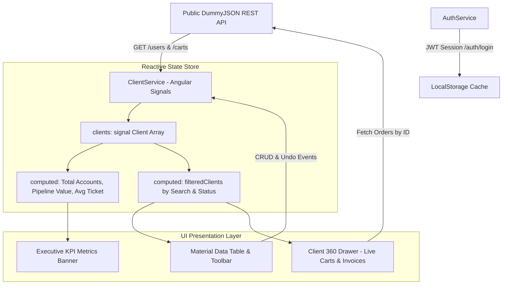

# NexusCRM &mdash; Enterprise Customer Intelligence & Operations Platform

[](https://angular.dev/)
[](https://angular.dev/guide/signals)
[](https://vitest.dev/)
[](https://playwright.dev/)
[](https://donatoalvarez.dev/NexusCRM/)
[](LICENSE)

An enterprise-grade, production-ready **Customer Relationship Management (CRM) & Account Intelligence Platform** built with **Angular 21**, **Angular Signals**, **Angular Material 3**, and powered by public real-time REST APIs. Designed to demonstrate scalable frontend architecture, reactive state management, resilient offline caching, and automated testing (Vitest & Playwright).

---

## 🚀 Live Demo & Access

Experience the production deployment directly in your browser:  
👉 **[https://donatoalvarez.dev/NexusCRM/](https://donatoalvarez.dev/NexusCRM/)**  
*(Alternate mirror: [https://donytxz.github.io/NexusCRM/](https://donytxz.github.io/NexusCRM/))*

### 🔐 Demo Credentials (Powered by Live DummyJSON Auth)
* **Usuario:** `emilys`
* **Contraseña:** `emilyspass`

---

## 🌟 Key Features & Architectural Highlights

### 1. Executive CRM Metrics Banner (Computed Signals)
- Real-time aggregate KPIs powered by Angular 21 `computed()` signals:
  - **Cuentas Registradas**: Dynamic directory size.
  - **Cuentas Activas / VIP**: Total portfolio in active sales pipeline.
  - **Cartera Gestionada**: Total commercial valuation calculated across all enterprise accounts.
  - **Ticket Promedio**: Dynamic average contract value per customer account.

### 2. Live Public API Integration (DummyJSON Users & Carts)
- Seamless connection to the public **DummyJSON REST API** (`/users` & `/carts`):
  - Fetches multi-attribute account profiles with real job titles, departments, corporate emails, and addresses.
  - **100% Free & Keyless**: Runs in any environment without proprietary backend licenses or paid API keys.

### 3. Interactive Client 360° Profile Drawer
- Clicking any customer row smoothly slides out a comprehensive **Account Intelligence Drawer**:
  - **Profile & Location**: Job designation, corporate parent company, address, and direct click-to-call / copy-to-clipboard actions.
  - **Transaction History**: Pulls live transaction and order history from `https://dummyjson.com/carts/user/:id` showing products purchased, thumbnails, unit prices, discounts, and order subtotals.
  - **Fiscal Metadata**: Legal tax residency, postal code, and account registration dates.

### 4. Real-time Search, Filtering & CSV Export
- Multi-attribute instant search across client names, companies, roles, and cities.
- Quick filter chips for immediate status segmentation (*Todos*, *VIP*, *Activos*, *Pendientes*).
- Client-side **CSV Export Engine** generating instant downloadable audit spreadsheets.

### 5. Reactive State & Optimistic UI Resilience
- State managed purely through **Angular Signals** (`signal`, `computed`).
- Optimistic updates for Create, Update, and Delete with instant 5-second **Undo Action** via `MatSnackBar`.
- Automated `localStorage` persistence ensuring user modifications survive page reloads and network loss.

---

## 🏗️ Architecture & Data Flow



---

## 🛠️ Testing Suite (Vitest & Playwright)

### 1. Unit Testing with Vitest
Blazing-fast native Vite test runner for Angular 21 signals, guards, and services:
```bash
# Run unit tests
npm run test:unit

# Watch mode
npm run test:unit:watch
```

### 2. End-to-End Testing with Playwright
Automated browser tests covering authentication, form validation, error banners, search filtering, and the Client 360° drawer:
```bash
# Run all E2E tests headless
npm run test:e2e

# Interactive UI Mode
npx playwright test --ui

# Headed mode for live browser inspection
npx playwright test e2e/login.spec.ts --headed
```

---

## ⚙️ Local Development Setup

```bash
# 1. Clone repository
git clone https://github.com/DonytXz/NexusCRM.git
cd NexusCRM

# 2. Install dependencies
npm install

# 3. Start development server
ng serve
# Open http://localhost:4200/
```

---

## 🛡️ License

This project is open-source under the [MIT License](LICENSE).
